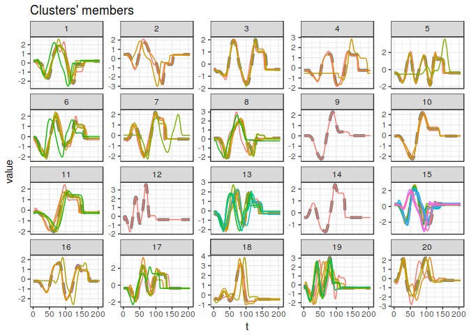
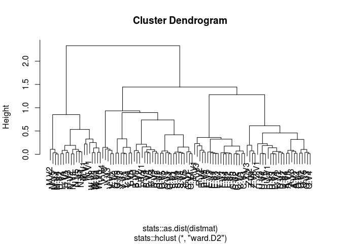
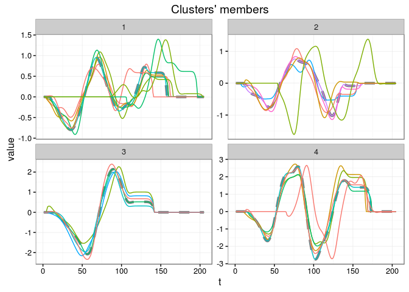
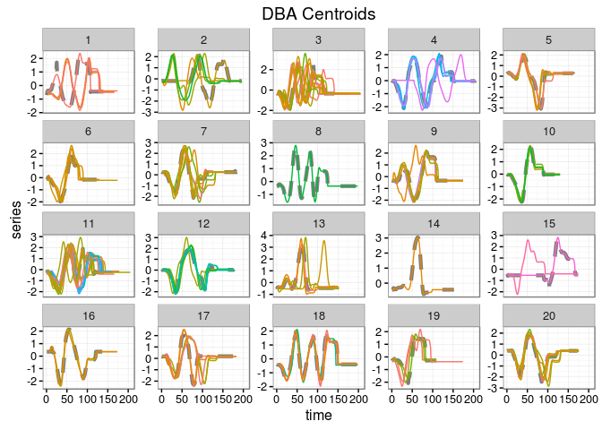

<!-- README.md is generated from README.Rmd. Please edit that file -->
[](http://cran.r-project.org/web/packages/dtwclust) [](http://cran.rstudio.com/package=dtwclust)

Time Series Clustering With Optimizations for the Dynamic Time Warping Distance (DTW)
=====================================================================================

Time series clustering with a wide variety of strategies and a series of optimizations specific to the Dynamic Time Warping (DTW) distance and its corresponding lower bounds (LBs). There are implementations of both traditional clustering algorithms, and more recent procedures such as k-Shape and TADPole clustering. The functionality can be easily extended with custom distance measures and centroid definitions.

Many of the algorithms implemented in this package are specifically tailored to time series and DTW, hence its name. However, the main clustering function is flexible so that one can test many different clustering approaches, using either the time series directly, or by applying suitable transformations and then clustering in the resulting space.

DTW is a dynamic programming algorithm that tries to find the optimum warping path between two series. Over the years, several variations have appeared in order to make the procedure faster or more efficient. Please refer to the included references for more information, especially Giorgino (2009), which is a good practical introduction.

Most optimizations require equal dimensionality, which means time series should have equal lengths. DTW itself does not require this, but it is relatively slow to compute. Other distance definitions may be used, or series could be reinterpolated to a matching length (Ratanamahatana and Keogh, 2004).

Implementations
---------------

-   Keogh's and Lemire's lower bounds
-   DTW Barycenter Averaging
-   k-Shape clustering
-   TADPole clustering
-   Fuzzy c-means

Examples
--------

``` r
## Load data
data(uciCT)

## Reinterpolate data to equal length
datalist <- zscore(CharTraj)
data <- lapply(CharTraj, reinterpolate, newLength = 180)

## Common controls
ctrl <- new("dtwclustControl", window.size = 20L, trace = TRUE)
```

``` r
## =============================================================================================
## Using DTW with help of lower bounds and PAM centroids
## =============================================================================================

ctrl@pam.precompute <- FALSE

kc.dtwlb <- dtwclust(data = data, k = 20, distance = "dtw_lb",
                     centroid = "pam", seed = 3247, 
                     control = ctrl)
#> Iteration 1: Changes / Distsum = 100 / 1747.417
#> Iteration 2: Changes / Distsum = 18 / 1417.733
#> Iteration 3: Changes / Distsum = 13 / 1349.521
#> Iteration 4: Changes / Distsum = 2 / 1311.201
#> Iteration 5: Changes / Distsum = 0 / 1311.201
#> 
#>  Elapsed time is 10.463 seconds.

plot(kc.dtwlb)
```

<!-- -->

``` r

ctrl@pam.precompute <- TRUE
```

``` r
## =============================================================================================
## Hierarchical clustering based on shape-based distance
## =============================================================================================

hc.sbd <- dtwclust(datalist, type = "hierarchical",
                   k = 19:21, distance = "sbd",
                   method = "all",
                   control = ctrl)
#> 
#>  Calculating distance matrix...
#> 
#>  Performing hierarchical clustering...
#> 
#>  Elapsed time is 0.681 seconds.

cat("Rand index for HC+SBD:\n")
#> Rand index for HC+SBD:
print(ri <- sapply(hc.sbd, randIndex, y = CharTrajLabels))
#>       ARI       ARI       ARI       ARI       ARI       ARI       ARI 
#> 0.7497894 0.6880051 0.3099641 0.5202854 0.4496453 0.5472890 0.3737120 
#>       ARI       ARI       ARI       ARI       ARI       ARI       ARI 
#> 0.4252906 0.7405012 0.7034438 0.3428238 0.5302644 0.5125830 0.5746408 
#>       ARI       ARI       ARI       ARI       ARI       ARI       ARI 
#> 0.4182468 0.4196458 0.7442112 0.7050215 0.3501627 0.5223116 0.5073598 
#>       ARI       ARI       ARI 
#> 0.5698466 0.4517139 0.4462202

plot(hc.sbd[[which.max(ri)]])
```

<!-- -->

``` r
## =============================================================================================
## TADPole clustering
## =============================================================================================

kc.tadp <- dtwclust(data, type = "tadpole", k = 20,
                    dc = 1.5, control = ctrl)
#> 
#> Entering TADPole...
#> 
#> TADPole completed, pruning percentage = 86.7%
#> 
#>  Elapsed time is 4.232 seconds.

plot(kc.tadp, clus = 1:4)
```

<!-- -->

``` r
## =============================================================================================
## Parallel support
## =============================================================================================

require(doParallel)
#> Loading required package: doParallel
#> Loading required package: foreach
#> Loading required package: iterators
cl <- makeCluster(detectCores(), "FORK")
invisible(clusterEvalQ(cl, library(dtwclust)))
registerDoParallel(cl)

## Registering a custom distance with proxy and using it (normalized DTW)
ndtw <- function(x, y, ...) {
     dtw::dtw(x, y, step.pattern = symmetric2,
              distance.only = TRUE, ...)$normalizedDistance
}

## Registering the function with 'proxy'
proxy::pr_DB$set_entry(FUN = ndtw, names=c("nDTW"),
                       loop = TRUE, type = "metric", distance = TRUE,
                       description = "Normalized DTW with L1 norm")

## Data with different lengths
kc.ndtw <- dtwclust(datalist, k = 20,
                    distance = "nDTW", centroid = "pam",
                    seed = 159, control = new("dtwclustControl", nrep = 8L))

sapply(kc.ndtw, randIndex, y = CharTrajLabels)
#>       ARI       ARI       ARI       ARI       ARI       ARI       ARI 
#> 0.6441685 0.5214422 0.4195909 0.4817210 0.5203554 0.5008337 0.5191187 
#>       ARI 
#> 0.5285412

## DBA centroids
kc <- dtwclust(datalist, k = 20,
               distance = "nDTW", centroid = "dba",
               seed = 9421, control = list(trace = TRUE))
#> Series have different lengths. Please confirm that the provided distance function supports this.
#> Iteration 1: Changes / Distsum = 100 / 5.057696
#> Iteration 2: Changes / Distsum = 2 / 3.594286
#> Iteration 3: Changes / Distsum = 1 / 3.550964
#> Iteration 4: Changes / Distsum = 0 / 3.531171
#> 
#>  Elapsed time is 18.523 seconds.

# Modifying some plot parameters
plot(kc, labs.arg = list(title = "DBA Centroids", x = "time", y = "series"))
```

<!-- -->

``` r

stopCluster(cl)
registerDoSEQ()
```

``` r
## =============================================================================================
## Fuzzy clustering (autocorrelation-based)
## =============================================================================================

# Calculate autocorrelation up to 50th lag, considering a list of time series as input
acf_fun <- function(dat) {
     lapply(dat, function(x) as.numeric(acf(x, lag.max = 50, plot = FALSE)$acf))
}

# Fuzzy c-means
fc <- dtwclust(datalist[1:25], type = "fuzzy", k = 5,
               preproc = acf_fun, distance = "L2",
               seed = 123)

fc
#> dtwclust(data = datalist[1:25], type = "fuzzy", k = 5, distance = "L2", 
#>     preproc = acf_fun, seed = 123)
#> 
#> fuzzy clustering with 5 clusters
#> Using L2 distance
#> Using acf_fun preprocessing
#> 
#> Time required for analysis:
#>    user  system elapsed 
#>   0.148   0.000   0.148 
#> 
#> Head of fuzzy memberships:
#> 
#>       cluster_1   cluster_2  cluster_3  cluster_4 cluster_5
#> A.V1 0.04550608 0.015278671 0.06017278 0.02854909 0.8504934
#> A.V2 0.02649930 0.007304681 0.03576385 0.01482575 0.9156064
#> A.V3 0.03891669 0.007107856 0.03584082 0.01348798 0.9046467
#> A.V4 0.09316283 0.194096301 0.10463724 0.20029868 0.4078050
#> A.V5 0.09423895 0.163296699 0.11727901 0.17605511 0.4491302
#> B.V1 0.39131228 0.034768969 0.35717141 0.07915848 0.1375889
```

Dependencies
------------

-   Partitional procedures are inspired by the `flexclust` package.
-   Hierarchical procedures use the native `hclust` function.
-   Cross-distances make use of the `proxy` package.
-   The core DTW calculations are done by the `dtw` package.
-   Plotting is done with the `ggplot2` package.
-   Parallel computation depends on the `foreach` package.
-   Random streams for repetitions of partitional procedures use the `rngtools` package.
