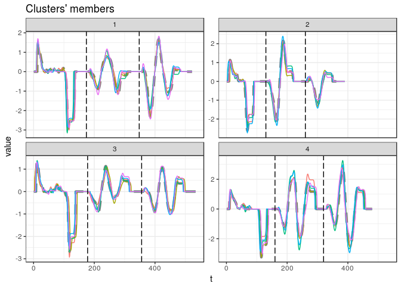

<!-- README.md is generated from README.Rmd. Please edit that file -->

[](https://cran.r-project.org/package=dtwclust)
[](https://travis-ci.org/asardaes/dtwclust)
[](https://ci.appveyor.com/project/asardaes/dtwclust)
[](https://codecov.io/gh/asardaes/dtwclust)
<http://cranlogs.r-pkg.org/badges/dtwclust>

# Time Series Clustering Along with Optimizations for the Dynamic Time Warping (DTW) Distance

Time series clustering with a wide variety of strategies and a series of
optimizations specific to the Dynamic Time Warping (DTW) distance and
its corresponding lower bounds (LBs). There are implementations of both
traditional clustering algorithms, and more recent procedures such as
k-Shape and TADPole clustering. Functionality can be easily extended
with custom distance measures and centroid definitions.

Many of the algorithms implemented in this package are specifically
tailored to DTW, hence its name. However, the main clustering function
is flexible so that one can test many different clustering approaches,
using either the time series directly, or by applying suitable
transformations and then clustering in the resulting space. Other
implementations included in the package provide some alternatives to
DTW.

For more information:

  - [Vignette with
    theory](https://cran.r-project.org/web/packages/dtwclust/vignettes/dtwclust.pdf)
    (with examples in the appendices)
  - [Timing
    experiments](https://cran.r-project.org/web/packages/dtwclust/vignettes/timing-experiments.html)
  - [Parallelization
    considerations](https://cran.r-project.org/web/packages/dtwclust/vignettes/parallelization-considerations.html)
  - [Functions’
    documentation](https://cran.r-project.org/web/packages/dtwclust/dtwclust.pdf)
  - [Sample shiny
    app](https://asardaes.shinyapps.io/dtwclust-tsclust-interactive/)
  - [CRAN’s time series
    view](https://cran.r-project.org/web/views/TimeSeries.html)

## Implementations

  - Partitional, hierarchical and fuzzy clustering
      - k-Shape clustering
          - Shape-based distance
          - Shape extraction for time series
      - TADPole clustering
  - An optimized version of DTW
  - Keogh’s and Lemire’s DTW lower bounds
  - Global alignment kernel (GAK) distance
  - DTW Barycenter Averaging
  - Soft-DTW (distance and centroid)
  - Some multivariate support (GAK, DTW and soft-DTW)
  - Cluster validity indices (crisp and fuzzy, internal and external)
  - Parallelization for most functions

## Installation

The latest version from CRAN can be installed with
`install.packages("dtwclust")`.

If you want to test the latest version from github, first install the
[prerequisites for R package
development](https://support.rstudio.com/hc/en-us/articles/200486498-Package-Development-Prerequisites)
(LaTeX is only neccesary if you want to build the vignette) as well as
the [remotes package](https://cran.r-project.org/package=remotes), and
then type `remotes::install_github("asardaes/dtwclust")`.

If you’re wondering about which version to install, take a look at the
[CHANGELOG](CHANGELOG.md) file, I try to keep it updated. Check the
[Unix](https://travis-ci.org/asardaes/dtwclust) and
[Windows](https://ci.appveyor.com/project/asardaes/dtwclust) continuous
integration builds to make sure everything is working, but do note that
they tend to fail for reasons unrelated to the package’s functionality.

## License

GNU General Public License v3.0. See [license](LICENSE) and
[copyrights](inst/COPYRIGHTS).

This software package was developed independently of any organization or
institution that is or has been associated with the author.

## Examples

``` r
# Load series
data("uciCT")
```

### Partitional

``` r
pc <- tsclust(CharTraj, type = "partitional", k = 20L, 
              distance = "dtw_basic", centroid = "pam", 
              seed = 3247L, trace = TRUE,
              args = tsclust_args(dist = list(window.size = 20L)))
#> 
#>  Precomputing distance matrix...
#> 
#> Iteration 1: Changes / Distsum = 100 / 1361.256
#> Iteration 2: Changes / Distsum = 8 / 1101.633
#> Iteration 3: Changes / Distsum = 2 / 1036.096
#> Iteration 4: Changes / Distsum = 0 / 1031.353
#> 
#>  Elapsed time is 0.412 seconds.
plot(pc)
```

<!-- -->

### Hierarchical

``` r
hc <- tsclust(CharTraj, type = "hierarchical", k = 20L, 
              distance = "sbd", trace = TRUE,
              control = hierarchical_control(method = "average"))
#> 
#> Calculating distance matrix...
#> Performing hierarchical clustering...
#> Extracting centroids...
#> 
#>  Elapsed time is 0.147 seconds.
plot(hc)
```

<!-- -->

### Fuzzy

``` r
# Calculate autocorrelation up to 50th lag, considering a list of time series as input
acf_fun <- function(series, ...) {
    lapply(series, function(x) { as.numeric(acf(x, lag.max = 50L, plot = FALSE)$acf) })
}
# Autocorrelation-based fuzzy c-means
fc <- tsclust(CharTraj[1L:25L], type = "fuzzy", k = 5L,
              preproc = acf_fun, distance = "L2",
              seed = 123L)
fc
#> fuzzy clustering with 5 clusters
#> Using l2 distance
#> Using fcm centroids
#> Using acf_fun preprocessing
#> 
#> Time required for analysis:
#>    user  system elapsed 
#>    0.03    0.00    0.03 
#> 
#> Head of fuzzy memberships:
#> 
#>       cluster_1   cluster_2  cluster_3  cluster_4 cluster_5
#> A.V1 0.04550608 0.015278671 0.06017278 0.02854909 0.8504934
#> A.V2 0.02649930 0.007304681 0.03576385 0.01482575 0.9156064
#> A.V3 0.03891669 0.007107856 0.03584082 0.01348798 0.9046467
#> A.V4 0.09316283 0.194096301 0.10463724 0.20029868 0.4078050
#> A.V5 0.09423895 0.163296699 0.11727901 0.17605511 0.4491302
#> B.V1 0.39131228 0.034768969 0.35717141 0.07915848 0.1375889
```

### *Some* multivariate support

``` r
# Multivariate series provided as a list of matrices, using GAK distance
mvc <- tsclust(CharTrajMV[1L:20L], k = 4L, distance = "gak", seed = 390L)
# Note how the variables of each series are appended one after the other in the plot
plot(mvc, labels = list(nudge_x = -10, nudge_y = 1))
```

<!-- -->
